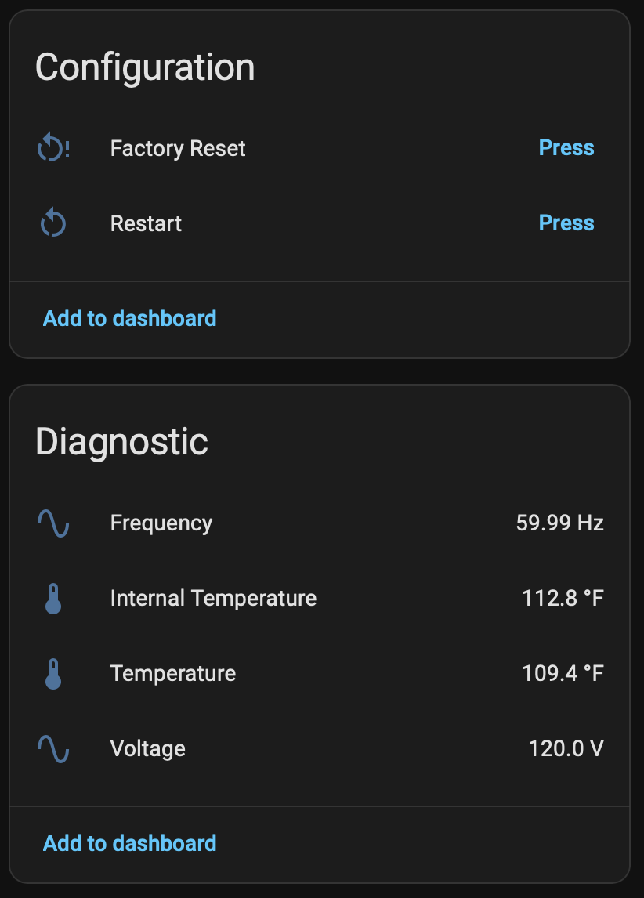

# Shelly Gen4 ESPHome

[](https://opensource.org/licenses/Apache-2.0)

[](../../stargazers)
[](https://buymeacoffee.com/automatous.io)

> **⚠️ Disclaimer.** Installing third-party firmware voids your Shelly warranty, and Shelly cannot provide technical support for a device running third-party code. Incorrect flashing can brick your device. Always back up your original firmware before proceeding. You assume all responsibility for any damage, data loss, or device failure. This project is not affiliated with Shelly, Allterco Robotics, ESPHome, CSA, or Espressif Systems.

ESPHome firmware install path for Shelly Gen4 devices, built on the ESP-Shelly-C68F module (ESP32-C6, 8MB flash) and deployed through the stock Shelly web UI or over UART. Upload one zip on the device's firmware update page and it reboots into ESPHome. After conversion the device runs on ESPHome with the native Home Assistant API and a local web page.

Every supported model is verified on real hardware, and the metering models are calibrated against a reference meter. From 1.0.0 the stable ids, substitution names, and package URLs only change with a major version - adopted devices can track `main`; changes arrive on your next rebuild.

---

## Contents

- [Supported devices](#supported-devices)
- [GPIO Map](docs/GPIO.md)
- [Install](#install)
- [First boot and adoption](#first-boot-and-adoption)
- [Customizing](#customizing)
- [Calibrating the power meter](#calibrating-the-power-meter)
- [The partition system](#the-partition-system)
- [Building](#building)
- [Changelog](CHANGELOG.md)
- [Credits](#credits)
- [License](#license)

---

## Supported devices

| Device | Config | Status |
|---|---|---|
| Shelly 1 Gen4 | [`configs/shelly-1-gen4.yaml`](configs/shelly-1-gen4.yaml) | Working |
| Shelly 1PM Gen4 | [`configs/shelly-1pm-gen4.yaml`](configs/shelly-1pm-gen4.yaml) | Working |
| Shelly 1 Mini Gen4 | [`configs/shelly-1-mini-gen4.yaml`](configs/shelly-1-mini-gen4.yaml) | Working |
| Shelly 1PM Mini Gen4 | [`configs/shelly-1pm-mini-gen4.yaml`](configs/shelly-1pm-mini-gen4.yaml) | Working |
| Shelly 2PM Gen4 | [`configs/shelly-2pm-gen4.yaml`](configs/shelly-2pm-gen4.yaml) | Working |

The pin assignments for every model are collected in [docs/GPIO.md](docs/GPIO.md).

The 1PM's relay, switch input, button, status LED, BL0942 power meter, and NTC are all confirmed on real hardware. The BL0942 runs at 9600 baud, not the chip's 4800 default, and the status LED is on GPIO11.

The 2PM's two relays, two switch inputs, button, status LED, NTC, and ADE7953 power meter are all confirmed on real hardware, with the meter calibrated per channel. The pin map deserves a note because the public sources disagree with each other and with the board: the [ESPHome Devices page](https://devices.esphome.io/devices/shelly-plus-2pm-gen-4/) contradicts its own YAML, the [Tasmota template](https://templates.blakadder.com/shelly_2PM_gen4.html) has the status LED on GPIO2 and the ESPHome page has it on GPIO0, and it is actually on GPIO18, found by probing every free pin. The config records which source each pin came from.

The 1PM Mini's relay, switch input, button, status LED, BL0942 power meter, and NTC are all confirmed on real hardware. No public pin map exists for this board, so every pin was found on the device. The relay (GPIO10), status LED (GPIO5), switch input (GPIO12), button (GPIO22), and NTC (GPIO4) match the 1 Mini Gen4, but the BL0942 is on TX GPIO20 / RX GPIO19 rather than the 1PM's GPIO6/GPIO7, found by sending the meter's read command on every free pin pair until one answered. This board also showed that stock firmware leaves the ESP32-C6's pad hold enabled on the relay and LED pins. A held pad ignores every write until the device loses power, and a web UI conversion only ever soft-resets, so the relay and LED sat frozen on every pin probe until the hold register was read. The config releases both holds at boot.

The 1 Mini's relay, switch input, button, status LED, and NTC are all confirmed on real hardware. The pin map is the 1PM Mini's without the meter (relay GPIO10, status LED GPIO5, switch input GPIO12, button GPIO22, NTC GPIO4), from shelly-1-gen4-matter-thread's [GPIO reference](https://github.com/automatous-io/shelly-1-gen4-matter-thread/blob/main/docs/GPIO.md). Stock firmware holds the relay and LED pads on this board too; the hold register read GPIO5 and GPIO10 on the first boot after a web UI conversion from stock 2.0.0, so the config releases both at boot.

The metering ships with reference constants measured on this board rather than ESPHome's defaults, which read about 9% low here. See [Calibrating the power meter](#calibrating-the-power-meter) for the numbers and how to redo them for your own unit.

---

## Install

Firmware is currently distributed as source only. [Build](#building) the artifacts first. A build produces `automatous-io-<model>-esphome-vX.Y.Z-ota.zip` for the stock web UI and `-uart.bin` for esptool over UART.

Web UI: open the Shelly's stock web page, choose to install firmware from a file, and upload the zip. The stock installer verifies it, writes it, and reboots into ESPHome. Conversion is tested from stock firmware 1.7.5 and 2.0.0.

**Check the running slot first.** The stock installer writes to whichever of its two app slots it is not running from, and the zip only converts a device running from slot 1. Open the stock web page's device info (or call `Shelly.GetDeviceInfo`) and look at `slot`. If it says 1, upload the zip. If it says 0, install any stock firmware first, the offered update or a file upload of an official build; that lands in slot 1 and makes it active, and the zip converts on the next upload. Factory firmware ships running from slot 0, and each stock update flips the slot, so a device straight out of the box, or one that has taken an even number of stock updates, needs this step. A zip uploaded on slot 0 does no harm: the installer logs `Skipping app`, stalls at 87%, writes nothing, and the device stays on stock. The mechanism is in [docs/PARTITIONS.md](docs/PARTITIONS.md#the-slot-rule).

UART:

```bash
# with the device open, in flash mode, and disconnected from mains
esptool --chip esp32c6 --port <PORT> read-flash 0x0 ALL shelly-<model>-gen4-stock-<MAC>.bin
esptool --chip esp32c6 --port <PORT> write-flash 0x0 automatous-io-shelly-<model>-gen4-esphome-vX.Y.Z-uart.bin
```

Both paths write the same layout; only the delivery differs. The web UI cannot back up the stock firmware; if you want the option to return to stock, take the full-chip UART backup above first. A restored backup returns the device to a fully functional factory state including Shelly Cloud (see [Credits](#credits) for where that is documented and tested).

---

## First boot and adoption

The conversion ships blank settings. The device opens a hotspot (`<model>-<suffix>`, so `shelly-1-gen4-52ab8c`, `shelly-1pm-gen4-52ab8c`, `shelly-1pm-mini-gen4-52ab8c`, or `shelly-2pm-gen4-52ab8c`, password `automatous`) with a captive portal at 192.168.4.1 to take your Wi-Fi credentials. Once connected, its web page is at `http://<model>-<suffix>.local` and Home Assistant discovers it through the native API. A Shelly 1 Gen4's device page in Home Assistant after conversion:

<p>
  
  
</p>

The 1PM adds live metering. Current, power, and energy sit with the controls, and voltage, frequency, and both temperatures are diagnostic. Energy is a primary sensor rather than a diagnostic one so it can feed Home Assistant's Energy Dashboard. The 1PM Mini exposes the same entities. Shown here switching a 140W resistive load:

<p>
  
  
</p>

The 2PM doubles the controls, with a mode and pulse length select per relay, and meters each output separately. Shown here with a 143W resistive load on O2:

<p>
  
</p>
<p>
  
  
</p>

The device also broadcasts a `dashboard_import` URL, so ESPHome Builder offers to adopt it. Adoption creates a minimal stub in your config directory, roughly (a 1PM, 1 Mini, 1PM Mini, or 2PM stub is identical with `shelly-1pm-gen4`, `shelly-1-mini-gen4`, `shelly-1pm-mini-gen4`, or `shelly-2pm-gen4` throughout):

```yaml
substitutions:
  name: shelly-1-gen4-52ab8c
  friendly_name: Shelly 1 Gen4

packages:
  automatous-io.shelly-1-gen4: github://automatous-io/shelly-gen4-esphome/configs/shelly-1-gen4.yaml@main

esphome:
  name: ${name}
  name_add_mac_suffix: false
  friendly_name: ${friendly_name}

api:
  encryption:
    key: ...
```

The stub is a reference, not a copy. Every build fetches this repository's config from `main` and merges your stub on top. That is also the update channel. Improvements pushed here reach your device the next time you hit Install, with nothing to edit on your side (package fetches are cached for up to a day). To pin a known state instead of tracking `main`, point the package ref at a tag or commit.

To factory reset, hold the device's button for 5 seconds (the `factory_reset_hold` substitution), or press the Factory Reset button in Home Assistant or on the device web page. This wipes all saved settings including Wi-Fi credentials and reboots into the first-boot hotspot.

---

## Customizing

Your stub is where customization lives. Substitutions are the main knobs. Add one to the stub's `substitutions:` block and rebuild, and your value overrides the default on every build after. For example:

```yaml
substitutions:
  name: shelly-1-gen4-52ab8c
  friendly_name: Garage Door
  relay_mode: "Momentary"
  relay_pulse: "1 s"
  relay_restore: "ALWAYS_OFF"
```

Substitutions supported by every model:

| Substitution | Default | Meaning |
|---|---|---|
| `device_name` | the model, e.g. `shelly-1-gen4` | node name and hostname base |
| `friendly_name` | the model, e.g. `Shelly 1 Gen4` | name shown in Home Assistant |
| `relay_mode` | `Latch` | initial relay mode, `Latch` or `Momentary` (both channels on the 2PM) |
| `relay_pulse` | `500 ms` | initial pulse length in Momentary mode (both channels on the 2PM) |
| `relay_restore` | `RESTORE_DEFAULT_OFF` | relay power-on behavior, also `RESTORE_DEFAULT_ON`, `ALWAYS_OFF`, `ALWAYS_ON` |
| `input_debounce` | `50ms` | switch input debounce filter |
| `log_level` | `INFO` | logger verbosity, `DEBUG` or `VERBOSE` for troubleshooting |
| `ap_password` | `automatous` | fallback hotspot password |
| `factory_reset_hold` | `5s` | button hold time before factory reset |

Additionally, for the models with an NTC (`shelly-1pm-gen4`, `shelly-1-mini-gen4`, `shelly-1pm-mini-gen4`, `shelly-2pm-gen4`):

| Substitution | Default | Meaning |
|---|---|---|
| `ntc_b_constant` | `3350` | NTC beta value; adjust to calibrate the temperature reading |

For the metering models (`shelly-1pm-gen4`, `shelly-1pm-mini-gen4`, `shelly-2pm-gen4`):

| Substitution | Default | Meaning |
|---|---|---|
| `power_update_interval` | `10s` | how often the power meter publishes |

For the 1PM and 1PM Mini (BL0942 meter):

| Substitution | Default | Meaning |
|---|---|---|
| `line_frequency` | `60Hz` | mains frequency, `50Hz` outside North America |
| `voltage_reference` | `14462.09548` on the 1PM, `14553.25051` on the 1PM Mini | BL0942 voltage scaling, measured on each board |
| `current_reference` | `253772.51527` on the 1PM, `255278.38517` on the 1PM Mini | BL0942 current scaling, measured on each board |

For the 2PM (ADE7953 meter):

| Substitution | Default | Meaning |
|---|---|---|
| `voltage_multiplier` | `0.9811` | voltage scaling, measured on this board |
| `current_1_multiplier`, `current_2_multiplier` | `3.747`, `3.808` | current scaling per channel, measured on this board |
| `power_1_multiplier`, `power_2_multiplier` | `-3.679`, `-3.718` | power scaling per channel, measured on this board; negative because both channels read reversed |
| `current_pga_gain` | `1x` | ADE7953 current channel hardware gain; leave at `1x`, see [Calibrating the power meter](#calibrating-the-power-meter) |

The 2PM has no `line_frequency` setting because the ADE7953 measures mains frequency itself; a 50Hz unit reports 50Hz with nothing to configure. The shipped multipliers were measured at 120V and the chip is linear, so they apply at 230V too.

Add a substitution to the stub only to change it. A default copied into the stub sticks; the device misses any later change to the default in this repository. Relay mode and pulse length are also select entities in Home Assistant and on the device page; those two substitutions only set starting values.

Beyond substitutions, standard ESPHome package merging applies: dictionaries deep-merge with the stub winning, lists append, and `!extend`/`!remove` reach into the package by id. What your stub merges over is exactly your model's config in [`configs/`](configs) plus the shared [`configs/shelly-gen4-base.yaml`](configs/shelly-gen4-base.yaml), so read those to see everything there is to change. Every model uses the same stable ids for the parts it has — `relay_1`, `relay_mode_select`, `pulse_select`, and `btn_factory_reset` — models with an NTC add `sensor_temperature`, and metering models add `sensor_voltage` and `sensor_frequency`. The 1PM and 1PM Mini have `sensor_current`, `sensor_power`, `sensor_energy`, and `uart_bl0942`. The 2PM has `relay_2`, `relay_2_mode_select`, `pulse_2_select`, per-channel `sensor_current_1`/`_2`, `sensor_power_1`/`_2`, `sensor_energy_1`/`_2`, and `ade7953_meter` on the `i2c_ade7953` bus:

```yaml
switch:
  - id: !extend relay_1
    icon: mdi:garage
```

Leave the base's `esp32:` block, `external_components` entry, and `shelly_gen4_partition:` alone; they are the [partition wiring](#the-partition-system).

---

## Calibrating the power meter

Applies to metering models. On the 1PM and 1PM Mini the BL0942 reports raw counts that ESPHome divides by a reference constant per channel, so calibration is one division:

```
new_reference = old_reference × (reported ÷ actual)
```

Read `reported` off the device and `actual` off a reference meter at the same moment, then set the result as a substitution in your stub. Frequency needs no calibration; it comes from zero-crossing timing and is already accurate.

On the 2PM each ADE7953 reading gets a multiplier instead, so the fraction flips:

```
new_multiplier = old_multiplier × (actual ÷ reported)
```

Voltage is shared, current and power are per channel, and power comes from the chip's own register rather than from voltage × current, so all five multipliers are measured separately. Calibrate one channel at a time with the load on that output, and keep the sign: both channels read negative on this board. The idle noise floor after scaling is about 0.07A per channel, so the same 100W+ resistive load advice applies. Energy is integrated on the device from power clamped at zero, so a wrong sign shows up on the power sensor but never walks the energy total backwards.

The shipped values are measured on real hardware rather than inherited, because ESPHome's defaults assume other boards. The 1PM's BL0942 reads about 9% low on voltage and 1% high on current out of the box, and the 1PM Mini's about 8% low and 2% high; the two boards' references land within 1% of each other. The 2PM's ADE7953 reads current and power about 3.7x low with the sign reversed on both channels, because ESPHome's driver was written for the Shelly 2.5 and this board's shunts differ. Each was measured on one unit against a consumer meter at roughly 140W resistive, so expect to land within a couple of percent rather than exactly on.

The 2PM corrects this in software rather than with the chip's 4x hardware gain. The chip's gain registers only reach 2x, so they cannot close the gap on their own, and on the Power Strip 4 Gen4 the hardware gain setting was found to occasionally revert to 1x after a reset, quartering the readings. Tasmota runs this chip at 1x on Shelly 2PM boards for the same reason. `current_pga_gain` is exposed for experiments, but the shipped multipliers assume `1x`.

Two things:

**Only calibrate voltage and current.** The driver derives `power_reference` from voltage × current, and `energy_reference` from `power_reference` in turn. The chip's power register tracks V × I closely, so once both channels are correct the derived power lands within a fraction of a percent. Setting `power_reference` by hand disables that derivation and makes power worse. Leave it unset.

**Use a load large enough to measure.** The current channel has a noise floor around 0.05A on the unit tested, which is larger than the entire signal from a 5W lamp. It does not behave as a constant offset at real loads, so do not subtract it; just measure somewhere it does not matter. Use 100W or more of resistive load, an incandescent bulb or a heating element. Anything with a switching supply or a motor has a power factor well below 1 and the two meters will disagree for real reasons rather than calibration ones.

---

## The partition system

The one non-standard thing about these devices. Shelly places the partition table at flash offset 0x10000 instead of ESP-IDF's default 0x8000, and the stock layout ([master copy](components/shelly_gen4_partition/shelly-gen4-stock.csv)) cannot change. This project exists to flash ESPHome through the stock web UI, and that requires keeping the stock firmware's partition scheme.

Two pieces keep every build in agreement, including adopted rebuilds that have never seen this repository. The `shelly_gen4_partition` external component ships the stock table into the build, and `CONFIG_PARTITION_TABLE_OFFSET: "0x10000"` in the base config makes the firmware look for the table where it actually is. Breaking the first is a build error, never device damage; removing the second produces firmware that installs but cannot find its partitions at boot. The full story, including the layout comparison and how the installer zip transplants the system, is in [docs/PARTITIONS.md](docs/PARTITIONS.md).

---

## Building

The repository ships a [dev container](.devcontainer) pinned to ESPHome 2026.8.2, the image the Home Assistant add-on is built from. Open the repository in VS Code, choose Reopen in Container, and build from its terminal:

```bash
python3 scripts/build.py shelly-1-gen4
```

ESP-IDF and the toolchain persist in a Docker volume, so only the first build downloads them. Without a container:

```bash
python3.13 -m venv ~/esphome-venv && source ~/esphome-venv/bin/activate && pip install esphome
python3 scripts/build.py shelly-1-gen4
```

Use Python 3.12 or newer. Current ESPHome requires it, and on an older interpreter pip silently installs a much older ESPHome instead of failing. A model's build directory under `configs/.esphome/` belongs to whichever environment last built it; delete it before switching between the container and a host venv.

Both artifacts are written to the repository root, stamped with the base config's project version; `--version` overrides it for test builds. Builds are verified with ESPHome 2026.7.2 and 2026.8.2. Run `python3 scripts/build.py` with no arguments to list buildable models, then pass one in place of `shelly-1-gen4` above; `esphome compile configs/<model>.yaml` works for a plain compile check. Builds print strapping pin warnings for whichever strapping pins that model wires to a relay, button, or LED — GPIO4, GPIO5, and GPIO15 on the 1 Gen4, GPIO4 on the 1PM, GPIO4 and GPIO5 on the 1PM Mini and the 2PM, plus a USB-Serial-JTAG note for the 1PM Mini's switch input and the 2PM's button, both on GPIO12; they are benign, Shelly's hardware dictates those pins.

---

## Credits

The Shelly 1PM Gen4 config started from the community [Shelly 1PM Gen 4 page](https://devices.esphome.io/devices/shelly-1pm-gen-4/) on ESPHome Devices. The shape of the `bl0942` block, the 9600 baud rate, and the NTC divider chain with its 10k/3350 starting values all come from there. The 2PM Gen4 pin map started from the [Shelly Plus 2PM Gen 4 page](https://devices.esphome.io/devices/shelly-plus-2pm-gen-4/) there and the [Tasmota template](https://templates.blakadder.com/shelly_2PM_gen4.html) on blakadder, decoded against Tasmota's source, then corrected on hardware. The software-scaling approach for its ADE7953 follows the [Power Strip 4 Gen4 calibration fix](https://github.com/esphome/devices.esphome.io/pull/1811). The 1PM Mini Gen4 has no public source; its starting guess was the 1 Mini Gen4 map in shelly-1-gen4-matter-thread's [GPIO reference](https://github.com/automatous-io/shelly-1-gen4-matter-thread/blob/main/docs/GPIO.md), which held for everything but the meter. The 1 Mini Gen4 config uses that same map directly.

Most of the device-specific knowledge here comes from [shelly-1-gen4-matter-thread](https://github.com/automatous-io/shelly-1-gen4-matter-thread), the Matter over Thread firmware for Shelly Gen4 devices: the stock partition offsets, the GPIO maps, the behavior of the stock installer, and the reversibility testing that established the full chip backup and restore path. Its [Flashing Guide](https://github.com/automatous-io/shelly-1-gen4-matter-thread/blob/main/docs/FLASHING.md) and [Reversibility](https://github.com/automatous-io/shelly-1-gen4-matter-thread/blob/main/docs/REVERSIBILITY.md) pages cover the UART wiring, flash mode, backup procedure, and test evidence in depth, and apply to this project unchanged.

---

## License

Everything in this repository (scripts, configs) is licensed under Apache 2.0. See [LICENSE](LICENSE).
