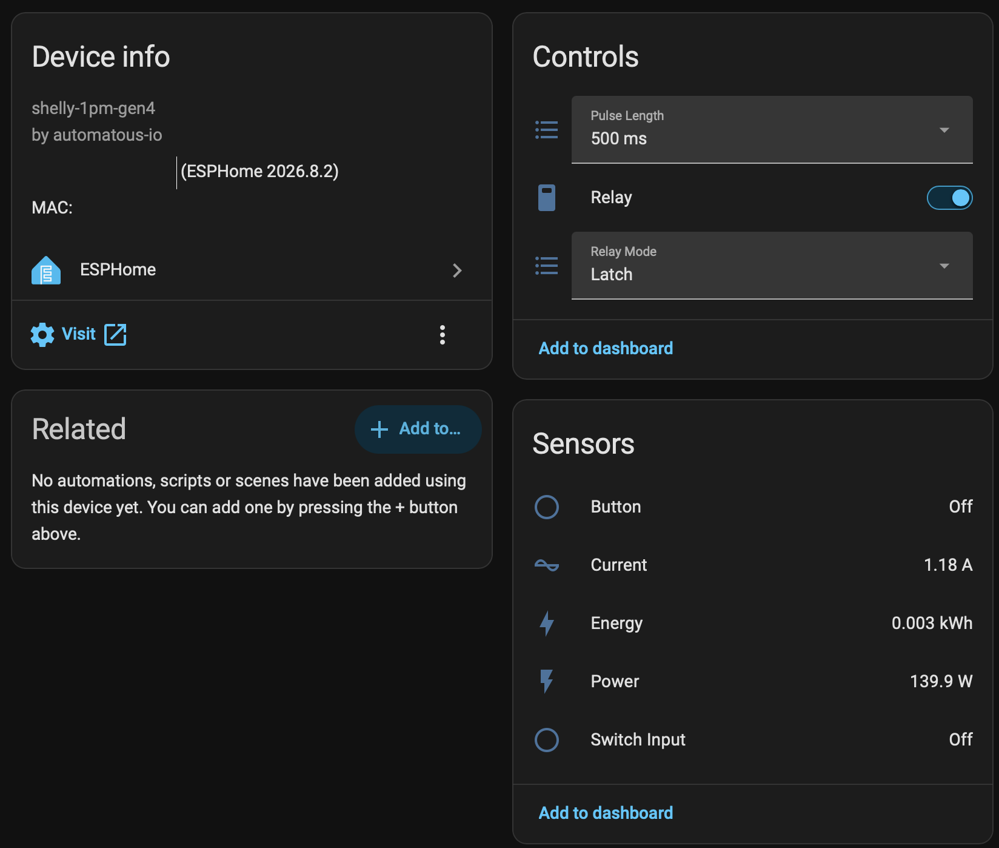
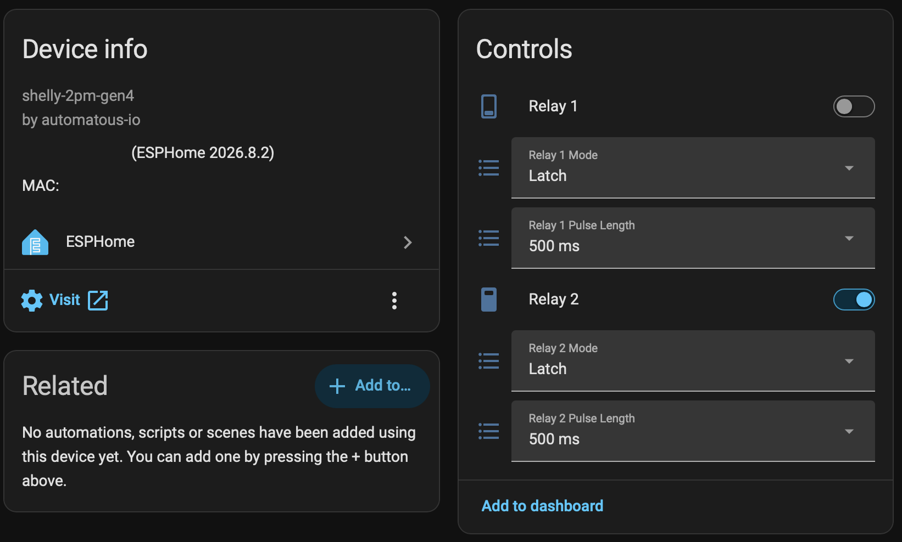
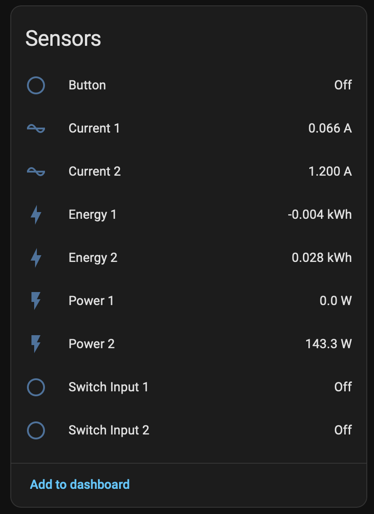
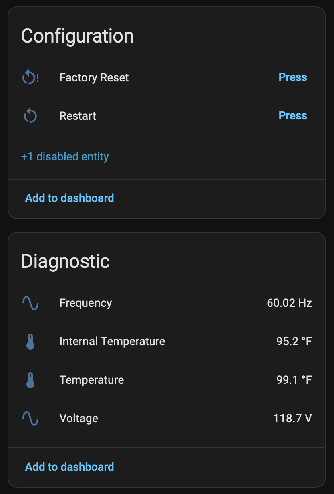

# Shelly Gen4 ESPHome

[](https://opensource.org/licenses/Apache-2.0)

[](../../stargazers)
[](https://buymeacoffee.com/automatous.io)

> **⚠️ Disclaimer.** Installing third-party firmware voids your Shelly warranty, and Shelly cannot provide technical support for a device running third-party code. Incorrect flashing can brick your device. Always back up your original firmware before proceeding. You assume all responsibility for any damage, data loss, or device failure. This project is not affiliated with Shelly, Allterco Robotics, ESPHome, CSA, or Espressif Systems.

ESPHome firmware and install path for Shelly Gen4 devices, built on the ESP-Shelly-C68F module (ESP32-C6, 8MB flash), deployed through the stock Shelly web UI or over UART. Upload one zip on the device's firmware update page and it reboots into ESPHome, with the native Home Assistant API and a local web page.

Every supported model is verified on real hardware, and the metering models are calibrated against a reference meter.

<p align="center">
  
</p>

*A Shelly 1PM Gen4 after conversion, adopted in Home Assistant through the native API. The relay with its mode and pulse length, and the meter reading 139.9W and 1.18A off a 140W resistive load.*

---

## Contents

- [Supported devices](#supported-devices)
- [In Home Assistant](#in-home-assistant)
- [Quick start](#quick-start)
- [Features](#features)
- [Roadmap](#roadmap)
- [Documentation](#documentation)
- [Repository layout](#repository-layout)
- [Credits](#credits)
- [Other projects from Automatous](#other-projects-from-automatous)
- [License](#license)

---

## Supported devices

| Device | Config | Status |
|---|---|---|
| Shelly 1 Gen4 | [`configs/shelly-1-gen4.yaml`](configs/shelly-1-gen4.yaml) | Working |
| Shelly 1PM Gen4 | [`configs/shelly-1pm-gen4.yaml`](configs/shelly-1pm-gen4.yaml) | Working |
| Shelly 1 Mini Gen4 | [`configs/shelly-1-mini-gen4.yaml`](configs/shelly-1-mini-gen4.yaml) | Working |
| Shelly 1PM Mini Gen4 | [`configs/shelly-1pm-mini-gen4.yaml`](configs/shelly-1pm-mini-gen4.yaml) | Working |
| Shelly 2PM Gen4 | [`configs/shelly-2pm-gen4.yaml`](configs/shelly-2pm-gen4.yaml) | Working |

Pin assignments for every model, and the hardware findings behind them, are in the [GPIO Map](docs/GPIO.md).

---

## In Home Assistant

Stock device pages, no custom cards.

<p align="center">
  
</p>

*The 2PM doubles the controls: two relays, each with its own mode and pulse length.*

<p align="center">
  
</p>

*And it meters each output separately. Here channel 2 carries a 143W load while channel 1 sits idle. Energy is a primary sensor on every metering model, so it feeds the Energy Dashboard.*

<p align="center">
  
</p>

*Voltage, mains frequency, and both temperatures are diagnostic, on every metering model.*

The non-metering models and the rest of the entities are in [First Boot and Adoption](docs/ADOPTION.md#in-home-assistant).

---

## Quick start

Firmware is currently distributed as source only, and the stock web UI needs no UART adapter.

1. [Build](docs/BUILDING.md) your model. This produces the web UI zip and a UART binary.
2. [Install it through the stock Shelly web UI](docs/INSTALL.md#stock-web-ui), after [checking the running slot](docs/INSTALL.md#check-the-running-slot-first).
3. [Join it to Wi-Fi and adopt it](docs/ADOPTION.md) in Home Assistant or ESPHome Builder.

Adoption points a small stub at this repository, so later improvements arrive on your next rebuild with nothing to edit. From 1.0.0 the stable ids, substitution names, and package URLs only change with a major version, so adopted devices can track `main`.

---

## Features

- Stock web UI install, no UART adapter required. UART is there if you want a backup of stock firmware first.
- Native Home Assistant API, plus a local web page on the device.
- ESPHome Builder adoption, with this repository as the update channel.
- Relay linking, latch or momentary mode, and pulse length, as Home Assistant selects and as build-time defaults.
- Switch input and onboard button, with configurable debounce and power-on restore behavior.
- Live metering on the PM models: current, power, energy, voltage, and frequency, calibrated against a reference meter. Energy is a primary sensor so it feeds the Energy Dashboard.
- Internal temperature on every model with an NTC.
- Factory reset by a 5 second button hold, from Home Assistant, or from the device page.
- Shelly's stock partition layout preserved, which is what lets the stock installer accept the build.

---

## Roadmap

- **Safety shutoff** — a power limit per channel and a temperature limit, latching the relay off until it is cleared. Planned, with nothing upstream in the way.
- **Thread** — the native Home Assistant API over Thread instead of Wi-Fi, through ESPHome's `openthread` component on the C6's 802.15.4 radio. Possible today, unproven on this hardware. Not Matter.

The detail, the dependencies, and what is actually in the way is in the [Roadmap](docs/ROADMAP.md).

---

## Documentation

Everything is in [`docs/`](docs/), with build [`scripts/`](scripts/) and the changelog at the repo root. The usual path is [Building](docs/BUILDING.md), then [Installing](docs/INSTALL.md), then [First Boot and Adoption](docs/ADOPTION.md).

- [Installing](docs/INSTALL.md) — the web UI path, the slot rule, UART, and backing up stock
- [First Boot and Adoption](docs/ADOPTION.md) — Wi-Fi setup, what lands in Home Assistant, and the adoption stub
- [Customizing](docs/CUSTOMIZING.md) — every substitution, the stable ids, and package merging
- [Calibrating the Power Meter](docs/CALIBRATION.md) — measuring the metering constants on your own unit
- [Building](docs/BUILDING.md) — the dev container, a host venv, and what a build produces
- [GPIO Map](docs/GPIO.md) — pin assignments per model and the hardware findings behind them
- [The Partition System](docs/PARTITIONS.md) — why stock ESPHome does not boot here, and how these builds do
- [Roadmap](docs/ROADMAP.md) — the planned safety shutoff, and what a Thread build would need
- [Changelog](CHANGELOG.md) — release history by model

---

## Repository layout

```
shelly-gen4-esphome/
├── README.md          This file.
├── LICENSE            Apache 2.0.
├── docs/              Documentation and the images it references.
├── scripts/           Build script and the stock web UI zip packager.
├── components/
│   └── shelly_gen4_partition/   External component that ships Shelly's stock partition table.
└── configs/
    ├── shelly-gen4-base.yaml    Shared base: ESP32-C6, partitions, API, web server, OTA.
    ├── shelly-1-gen4.yaml       Relay, switch input, button, status LED.
    ├── shelly-1pm-gen4.yaml     Adds a BL0942 power meter and an NTC.
    ├── shelly-1-mini-gen4.yaml  Mini form factor, with an NTC.
    ├── shelly-1pm-mini-gen4.yaml  Mini form factor, BL0942 meter and NTC.
    └── shelly-2pm-gen4.yaml     Two relays, two switch inputs, per-channel ADE7953 metering.
```

Each model config is a package your adoption stub references. See [Customizing](docs/CUSTOMIZING.md) for what a stub can change.

---

## Credits

The Shelly 1PM Gen4 config started from the community [Shelly 1PM Gen 4 page](https://devices.esphome.io/devices/shelly-1pm-gen-4/) on ESPHome Devices. The shape of the `bl0942` block, the 9600 baud rate, and the NTC divider chain with its 10k/3350 starting values all come from there. The 2PM Gen4 pin map started from the [Shelly Plus 2PM Gen 4 page](https://devices.esphome.io/devices/shelly-plus-2pm-gen-4/) there and the [Tasmota template](https://templates.blakadder.com/shelly_2PM_gen4.html) on blakadder, decoded against Tasmota's source, then corrected on hardware. The software-scaling approach for its ADE7953 follows the [Power Strip 4 Gen4 calibration fix](https://github.com/esphome/devices.esphome.io/pull/1811). The 1PM Mini Gen4 has no public source; its starting guess was the 1 Mini Gen4 map in shelly-1-gen4-matter-thread's [GPIO reference](https://github.com/automatous-io/shelly-1-gen4-matter-thread/blob/main/docs/GPIO.md), which held for everything but the meter. The 1 Mini Gen4 config uses that same map directly.

Most of the device-specific knowledge here comes from [shelly-1-gen4-matter-thread](https://github.com/automatous-io/shelly-1-gen4-matter-thread), the Matter over Thread firmware for Shelly Gen4 devices: the stock partition offsets, the GPIO maps, the behavior of the stock installer, and the reversibility testing that established the full chip backup and restore path. Its [Flashing Guide](https://github.com/automatous-io/shelly-1-gen4-matter-thread/blob/main/docs/FLASHING.md) and [Reversibility](https://github.com/automatous-io/shelly-1-gen4-matter-thread/blob/main/docs/REVERSIBILITY.md) pages cover the UART wiring, flash mode, backup procedure, and test evidence in depth, and apply to this project unchanged.

---

## Other projects from Automatous

| Project | What it is |
|---|---|
| [Shelly Gen4 Matter over Thread](https://github.com/automatous-io/shelly-1-gen4-matter-thread) | The first third-party open source Matter over Thread firmware for Shelly Gen4 devices. Native in Apple Home, Google Home, Alexa, and Home Assistant. No app, no cloud, no WiFi. |
| [XIAO Soil Moisture Sensor](https://github.com/automatous-io/xiao-soil-moisture-sensor-matter-thread) | Open source Matter over Thread firmware for the $12 Seeed Studio XIAO Soil Moisture Sensor. A Matter 1.5 soil sensor, native in Home Assistant. |
| [T1N Smart Lock](https://github.com/automatous-io/t1n-smart-lock) | Open source Matter over Thread smart lock that integrates with the factory central locking on a 2005 Dodge Sprinter 2500 (T1N chassis). Observation based, OEM respectful. |

---

## License

Everything in this repository (scripts, configs) is licensed under Apache 2.0. See [LICENSE](LICENSE).
