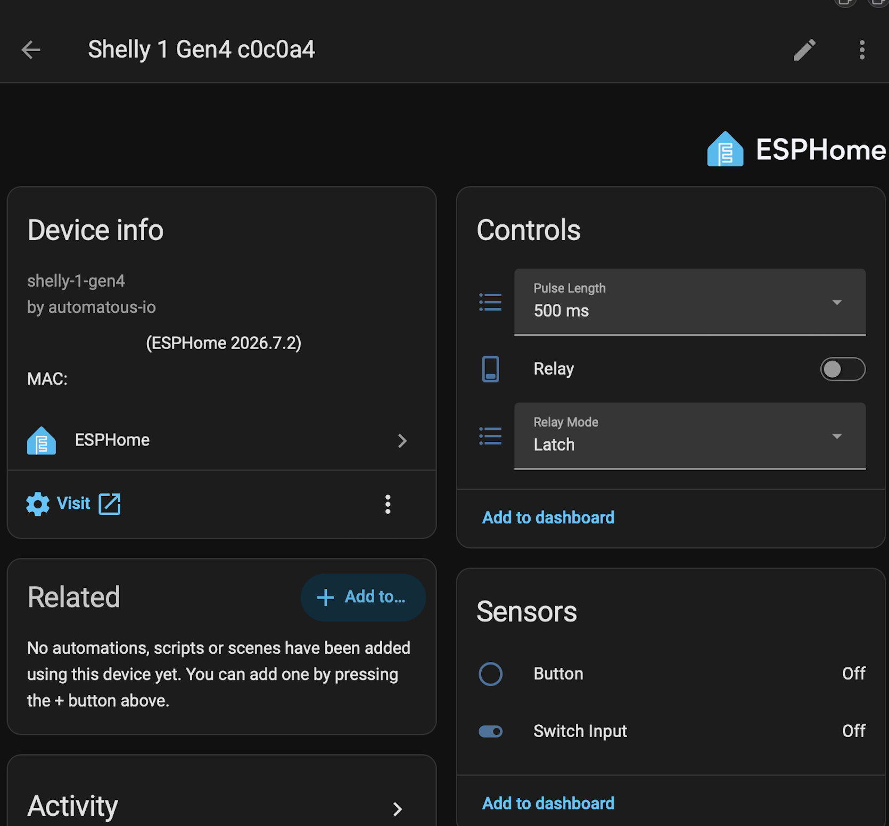
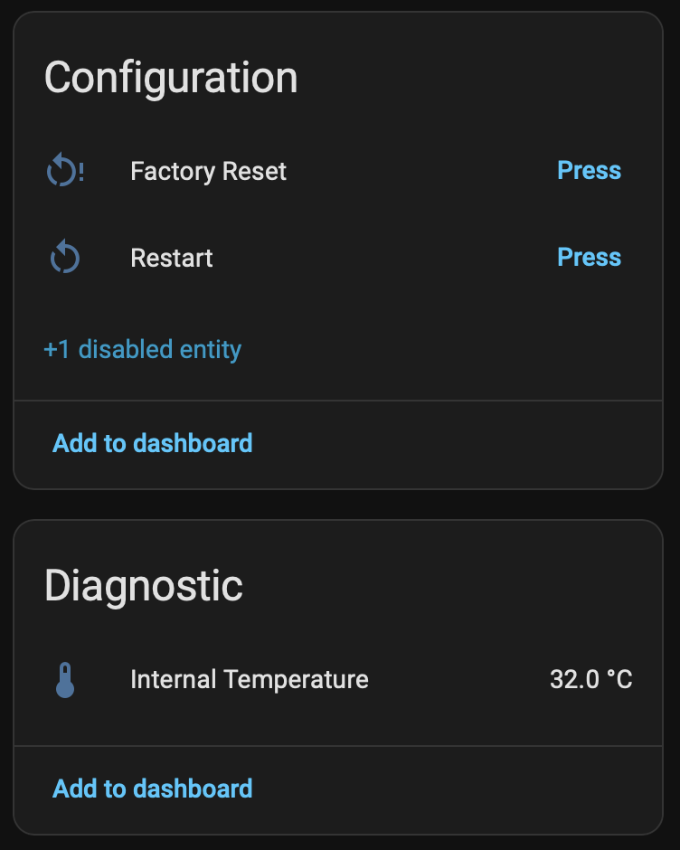

# Shelly Gen4 ESPHome

[](https://opensource.org/licenses/Apache-2.0)

[](../../stargazers)
[](https://buymeacoffee.com/automatous.io)

> **⚠️ Disclaimer.** Installing third-party firmware voids your Shelly warranty, and Shelly cannot provide technical support for a device running third-party code. Incorrect flashing can brick your device. Always back up your original firmware before proceeding. You assume all responsibility for any damage, data loss, or device failure. This project is not affiliated with Shelly, Allterco Robotics, ESPHome, CSA, or Espressif Systems.

ESPHome firmware install path for Shelly Gen4 devices, built on the ESP-Shelly-C68F module (ESP32-C6, 8MB flash) and deployed through the stock Shelly web UI or over UART. Upload one zip on the device's firmware update page and it reboots into ESPHome. After conversion the device runs on ESPHome with the native Home Assistant API and a local web page.

The project is in beta. Versions stay on 0.0.x while features are added and proven on real hardware, and adopted devices track `main`; changes arrive on your next rebuild.

---

## Contents

- [Supported devices](#supported-devices)
- [Install](#install)
- [First boot and adoption](#first-boot-and-adoption)
- [Customizing](#customizing)
- [Calibrating the power meter](#calibrating-the-power-meter)
- [The partition system](#the-partition-system)
- [Building](#building)
- [Changelog](CHANGELOG.md)
- [Credits](#credits)
- [License](#license)

---

## Supported devices

| Device | Config | Status |
|---|---|---|
| Shelly 1 Gen4 | [`configs/shelly-1-gen4.yaml`](configs/shelly-1-gen4.yaml) | Working |
| Shelly 1PM Gen4 | [`configs/shelly-1pm-gen4.yaml`](configs/shelly-1pm-gen4.yaml) | Working |
| Shelly 1 Mini Gen4 | none yet | Planned, PRs welcome |
| Shelly 2PM Gen4 | none yet | Planned, PRs welcome |

The 1PM's relay, switch input, button, status LED, BL0942 power meter, and NTC are all confirmed on real hardware. The BL0942 runs at 9600 baud, not the chip's 4800 default, and the status LED is on GPIO11.

The metering ships with reference constants measured on this board rather than ESPHome's defaults, which read about 9% low here. See [Calibrating the power meter](#calibrating-the-power-meter) for the numbers and how to redo them for your own unit.

---

## Install

Firmware is currently distributed as source only. [Build](#building) the artifacts first. A build produces `automatous-io-<model>-esphome-vX.Y.Z-ota.zip` for the stock web UI and `-uart.bin` for esptool over UART.

Web UI: open the Shelly's stock web page, choose to install firmware from a file, and upload the zip. The stock installer verifies it, writes it, and reboots into ESPHome. Conversion is tested from stock firmware 1.7.5 and 2.0.0.

UART:

```bash
# with the device open, in flash mode, and disconnected from mains
esptool --chip esp32c6 --port <PORT> read-flash 0x0 ALL shelly-<model>-gen4-stock-<MAC>.bin
esptool --chip esp32c6 --port <PORT> write-flash 0x0 automatous-io-shelly-<model>-gen4-esphome-vX.Y.Z-uart.bin
```

Both paths write the same layout; only the delivery differs. The web UI cannot back up the stock firmware; if you want the option to return to stock, take the full-chip UART backup above first. A restored backup returns the device to a fully functional factory state including Shelly Cloud (see [Credits](#credits) for where that is documented and tested).

---

## First boot and adoption

The conversion ships blank settings. The device opens a hotspot (`<model>-<suffix>`, so `shelly-1-gen4-52ab8c` or `shelly-1pm-gen4-52ab8c`, password `automatous`) with a captive portal at 192.168.4.1 to take your Wi-Fi credentials. Once connected, its web page is at `http://<model>-<suffix>.local` and Home Assistant discovers it through the native API. A Shelly 1 Gen4's device page in Home Assistant after conversion:

<p>
  
  
</p>

The 1PM adds live metering. Current, power, and energy sit with the controls, and voltage, frequency, and both temperatures are diagnostic. Energy is a primary sensor rather than a diagnostic one so it can feed Home Assistant's Energy Dashboard. Shown here switching a 140W resistive load:

<p>
  
  
</p>

The device also broadcasts a `dashboard_import` URL, so ESPHome Builder offers to adopt it. Adoption creates a minimal stub in your config directory, roughly (a 1PM stub is identical with `shelly-1pm-gen4` throughout):

```yaml
substitutions:
  name: shelly-1-gen4-52ab8c
  friendly_name: Shelly 1 Gen4

packages:
  automatous-io.shelly-1-gen4: github://automatous-io/shelly-gen4-esphome/configs/shelly-1-gen4.yaml@main

esphome:
  name: ${name}
  name_add_mac_suffix: false
  friendly_name: ${friendly_name}

api:
  encryption:
    key: ...
```

The stub is a reference, not a copy. Every build fetches this repository's config from `main` and merges your stub on top. That is also the update channel. Improvements pushed here reach your device the next time you hit Install, with nothing to edit on your side (package fetches are cached for up to a day). To pin a known state instead of tracking `main`, point the package ref at a tag or commit.

To factory reset, hold the device's button for 5 seconds (the `factory_reset_hold` substitution), or press the Factory Reset button in Home Assistant or on the device web page. This wipes all saved settings including Wi-Fi credentials and reboots into the first-boot hotspot.

---

## Customizing

Your stub is where customization lives. Substitutions are the main knobs. Add one to the stub's `substitutions:` block and rebuild, and your value overrides the default on every build after. For example:

```yaml
substitutions:
  name: shelly-1-gen4-52ab8c
  friendly_name: Garage Door
  relay_mode: "Momentary"
  relay_pulse: "1 s"
  relay_restore: "ALWAYS_OFF"
```

Substitutions supported by every model:

| Substitution | Default | Meaning |
|---|---|---|
| `device_name` | the model, e.g. `shelly-1-gen4` | node name and hostname base |
| `friendly_name` | the model, e.g. `Shelly 1 Gen4` | name shown in Home Assistant |
| `relay_mode` | `Latch` | initial relay mode, `Latch` or `Momentary` |
| `relay_pulse` | `500 ms` | initial pulse length in Momentary mode |
| `relay_restore` | `RESTORE_DEFAULT_OFF` | relay power-on behavior, also `RESTORE_DEFAULT_ON`, `ALWAYS_OFF`, `ALWAYS_ON` |
| `input_debounce` | `50ms` | switch input debounce filter |
| `log_level` | `INFO` | logger verbosity, `DEBUG` or `VERBOSE` for troubleshooting |
| `ap_password` | `automatous` | fallback hotspot password |
| `factory_reset_hold` | `5s` | button hold time before factory reset |

Additionally, for the metering models (`shelly-1pm-gen4`):

| Substitution | Default | Meaning |
|---|---|---|
| `line_frequency` | `60Hz` | mains frequency, `50Hz` outside North America |
| `power_update_interval` | `10s` | how often the power meter publishes |
| `ntc_b_constant` | `3350` | NTC beta value; adjust to calibrate the temperature reading |
| `voltage_reference` | `14462.09548` | BL0942 voltage scaling, measured on this board |
| `current_reference` | `253772.51527` | BL0942 current scaling, measured on this board |

Add a substitution to the stub only to change it. A default copied into the stub sticks; the device misses any later change to the default in this repository. Relay mode and pulse length are also select entities in Home Assistant and on the device page; those two substitutions only set starting values.

Beyond substitutions, standard ESPHome package merging applies: dictionaries deep-merge with the stub winning, lists append, and `!extend`/`!remove` reach into the package by id. What your stub merges over is exactly your model's config in [`configs/`](configs) plus the shared [`configs/shelly-gen4-base.yaml`](configs/shelly-gen4-base.yaml), so read those to see everything there is to change. Every model uses the same stable ids for the parts it has — `relay_1`, `relay_mode_select`, `pulse_select`, and `btn_factory_reset` — and metering models add `sensor_voltage`, `sensor_current`, `sensor_power`, `sensor_frequency`, `sensor_energy`, `sensor_temperature`, and `uart_bl0942`:

```yaml
switch:
  - id: !extend relay_1
    icon: mdi:garage
```

Leave the base's `esp32:` block, `external_components` entry, and `shelly_gen4_partition:` alone; they are the [partition wiring](#the-partition-system).

---

## Calibrating the power meter

Applies to metering models. The BL0942 reports raw counts that ESPHome divides by a reference constant per channel, so calibration is one division:

```
new_reference = old_reference × (reported ÷ actual)
```

Read `reported` off the device and `actual` off a reference meter at the same moment, then set the result as a substitution in your stub. Frequency needs no calibration; it comes from zero-crossing timing and is already accurate.

The shipped values are measured on real hardware rather than inherited. ESPHome's defaults assume the BL0942 reference design, but Shelly uses a different voltage divider, so out of the box this board reads about 9% low on voltage and 1% high on current. They were measured on one unit (hw rev v0.1.2) against a consumer meter at a 139W resistive load, so expect to land within a couple of percent rather than exactly on.

Two things:

**Only calibrate voltage and current.** The driver derives `power_reference` from voltage × current, and `energy_reference` from `power_reference` in turn. The chip's power register tracks V × I closely, so once both channels are correct the derived power lands within a fraction of a percent. Setting `power_reference` by hand disables that derivation and makes power worse. Leave it unset.

**Use a load large enough to measure.** The current channel has a noise floor around 0.05A on the unit tested, which is larger than the entire signal from a 5W lamp. It does not behave as a constant offset at real loads, so do not subtract it; just measure somewhere it does not matter. Use 100W or more of resistive load, an incandescent bulb or a heating element. Anything with a switching supply or a motor has a power factor well below 1 and the two meters will disagree for real reasons rather than calibration ones.

---

## The partition system

The one non-standard thing about these devices. Shelly places the partition table at flash offset 0x10000 instead of ESP-IDF's default 0x8000, and the stock layout ([master copy](components/shelly_gen4_partition/shelly-gen4-stock.csv)) cannot change. This project exists to flash ESPHome through the stock web UI, and that requires keeping the stock firmware's partition scheme.

Two pieces keep every build in agreement, including adopted rebuilds that have never seen this repository. The `shelly_gen4_partition` external component ships the stock table into the build, and `CONFIG_PARTITION_TABLE_OFFSET: "0x10000"` in the base config makes the firmware look for the table where it actually is. Breaking the first is a build error, never device damage; removing the second produces firmware that installs but cannot find its partitions at boot. The full story, including the layout comparison and how the installer zip transplants the system, is in [docs/PARTITIONS.md](docs/PARTITIONS.md).

---

## Building

```bash
python3.13 -m venv ~/esphome-venv && source ~/esphome-venv/bin/activate && pip install esphome
python3 scripts/build.py shelly-1-gen4
```

Use Python 3.12 or newer. Current ESPHome requires it, and on an older interpreter pip silently installs a much older ESPHome instead of failing.

Both artifacts are written to the repository root, stamped with the base config's project version; `--version` overrides it for test builds. Builds are verified with ESPHome 2026.7.2 and 2026.8.2. Run `python3 scripts/build.py` with no arguments to list buildable models, then pass one in place of `shelly-1-gen4` above; `esphome compile configs/<model>.yaml` works for a plain compile check. Builds print strapping pin warnings for whichever strapping pins that model wires to a relay, button, or LED — GPIO4, GPIO5, and GPIO15 on the 1 Gen4, GPIO4 on the 1PM; they are benign, Shelly's hardware dictates those pins.

---

## Credits

The Shelly 1PM Gen4 config started from the community [Shelly 1PM Gen 4 page](https://devices.esphome.io/devices/shelly-1pm-gen-4/) on ESPHome Devices. The shape of the `bl0942` block, the 9600 baud rate, and the NTC divider chain with its 10k/3350 starting values all come from there.

Most of the device-specific knowledge here comes from [shelly-1-gen4-matter-thread](https://github.com/automatous-io/shelly-1-gen4-matter-thread), the Matter over Thread firmware for Shelly Gen4 devices: the stock partition offsets, the GPIO maps, the behavior of the stock installer, and the reversibility testing that established the full chip backup and restore path. Its [Flashing Guide](https://github.com/automatous-io/shelly-1-gen4-matter-thread/blob/main/docs/FLASHING.md) and [Reversibility](https://github.com/automatous-io/shelly-1-gen4-matter-thread/blob/main/docs/REVERSIBILITY.md) pages cover the UART wiring, flash mode, backup procedure, and test evidence in depth, and apply to this project unchanged.

---

## License

Everything in this repository (scripts, configs) is licensed under Apache 2.0. See [LICENSE](LICENSE).
