# First Boot and Adoption

**[README](../README.md)** > **First Boot and Adoption** · [Report an issue](../../../issues/new)

What happens after the conversion reboots: joining Wi-Fi, what shows in Home Assistant, and the small stub that makes this repository your update channel.

## Contents

- [First boot](#first-boot)
- [In Home Assistant](#in-home-assistant)
- [Adoption and the stub](#adoption-and-the-stub)
- [The update channel](#the-update-channel)
- [Factory reset](#factory-reset)

## First boot

The conversion ships blank settings. The device opens a hotspot (`<model>-<suffix>`, so `shelly-1-gen4-52ab8c`, `shelly-1pm-gen4-52ab8c`, `shelly-1-mini-gen4-52ab8c`, `shelly-1pm-mini-gen4-52ab8c`, `shelly-2pm-gen4-52ab8c`, `shelly-plug-us-gen4-52ab8c`, or `shelly-em-mini-gen4-52ab8c`, password `automatous`) with a captive portal at 192.168.4.1 to take your Wi-Fi credentials.

Once connected, its web page is at `http://<model>-<suffix>.local` and Home Assistant discovers it through the native API.

## In Home Assistant

A Shelly 1 Gen4's device page after conversion:

<p>
  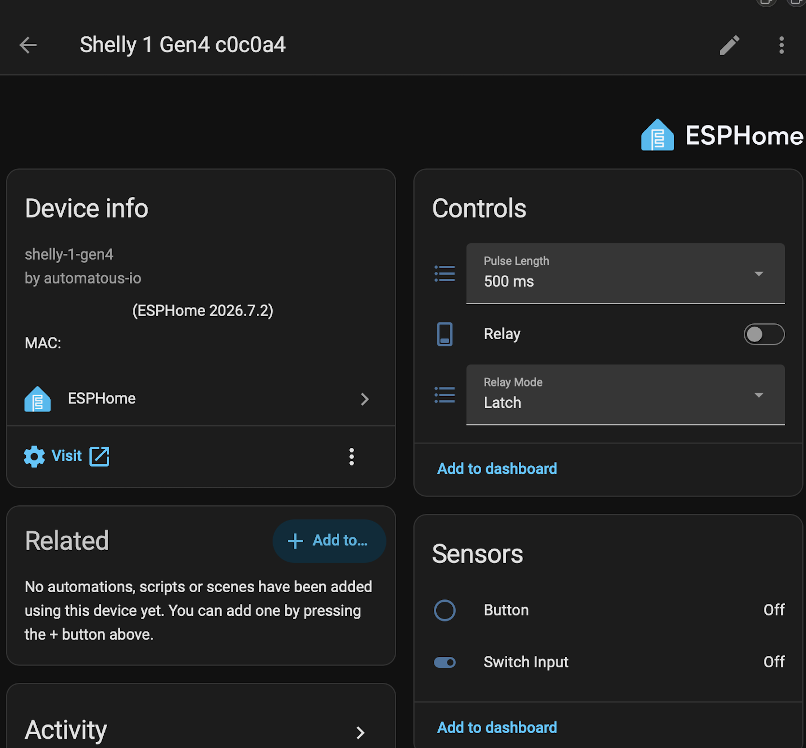
  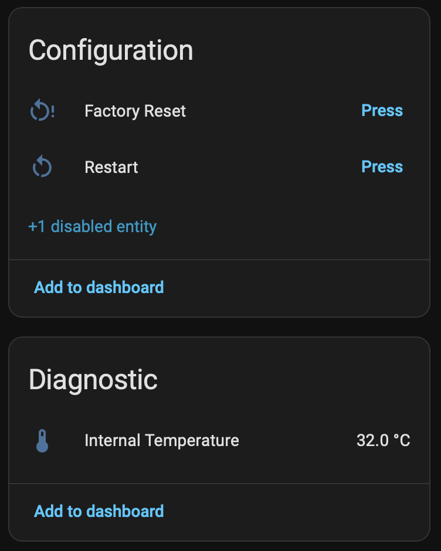
</p>

The 1PM adds live metering. Current, power, and energy sit with the controls, and voltage, frequency, and both temperatures are diagnostic. Energy is a primary sensor rather than a diagnostic one so it can feed Home Assistant's Energy Dashboard. The 1PM Mini exposes the same entities. Shown here switching a 140W resistive load:

<p>
  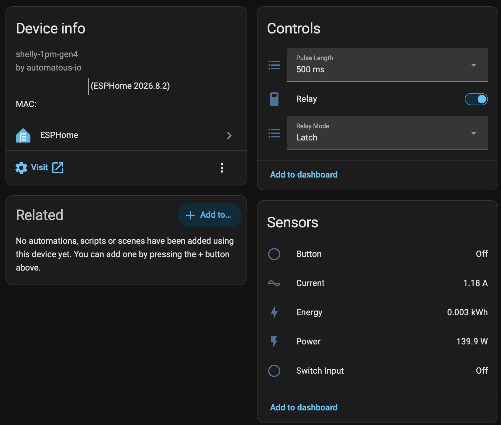
  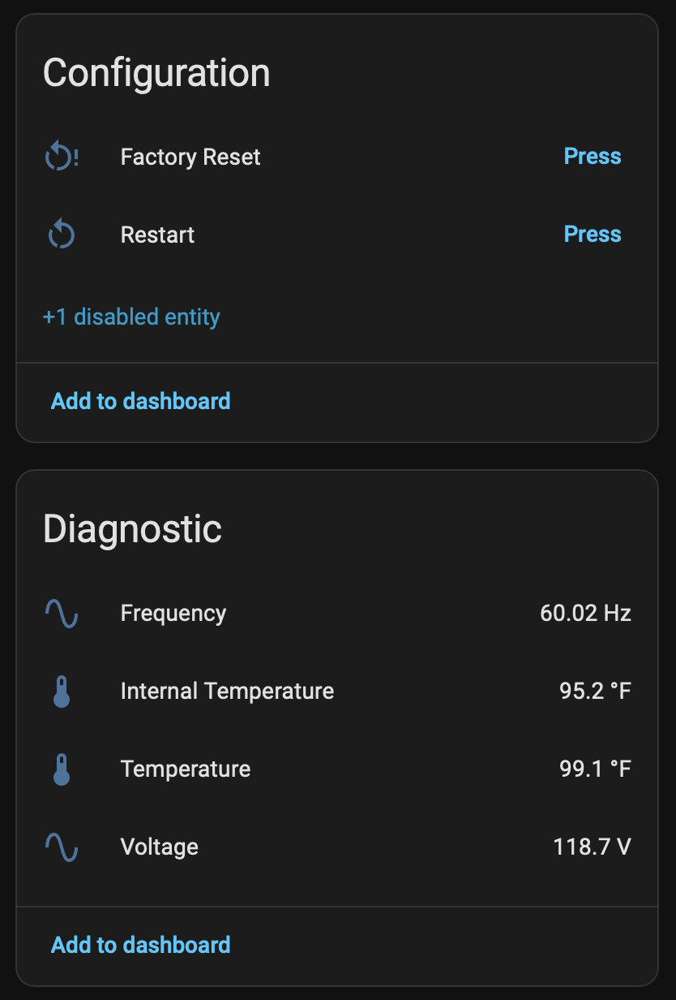
</p>

The 2PM doubles the controls, with linking, mode, and pulse length selects per relay, and meters each output separately. Shown here with a 143W resistive load on O2:

<p>
  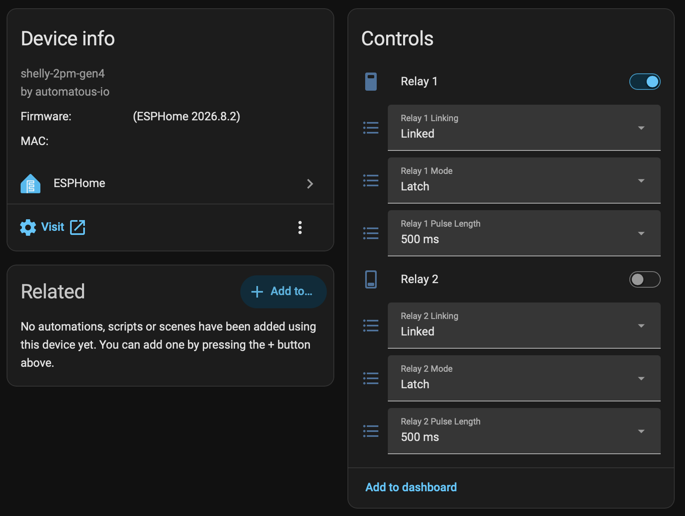
</p>
<p>
  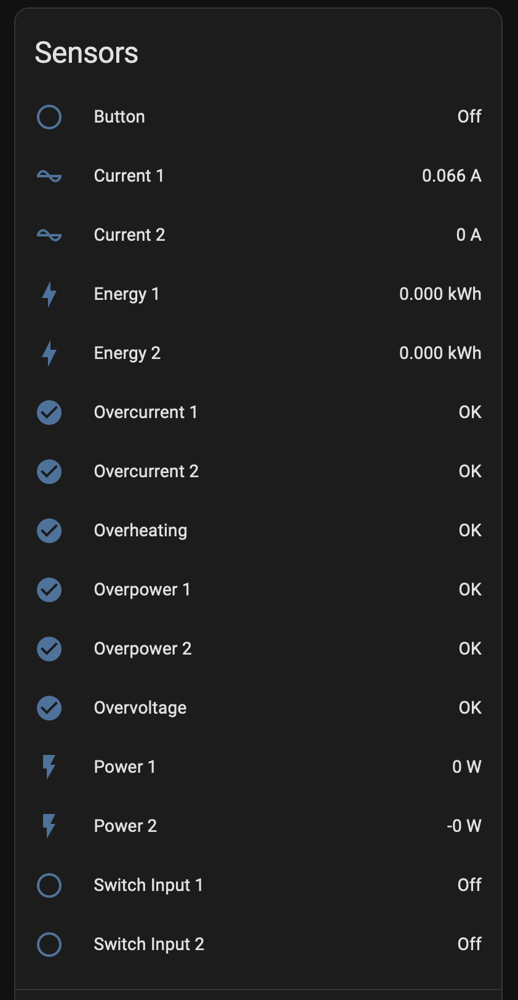
  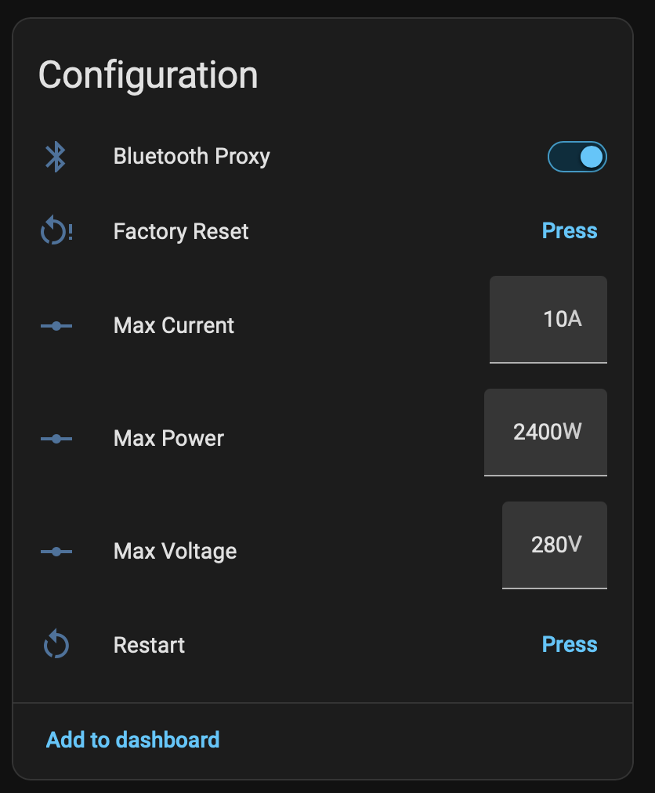
</p>

The Plug US has the 1PM's metering entities and the same linking, mode, and pulse length selects, with the button as the linked input. It adds the `LED Ring` light, a `Ring Mode` select (`Power`, `Relay State`, or `Manual`), `Illuminance` in lux, and `Illumination` as dark, twilight, or bright. The ring blinks blue while Wi-Fi or Home Assistant is disconnected. Shown here with a 141W resistive load:

<p>
  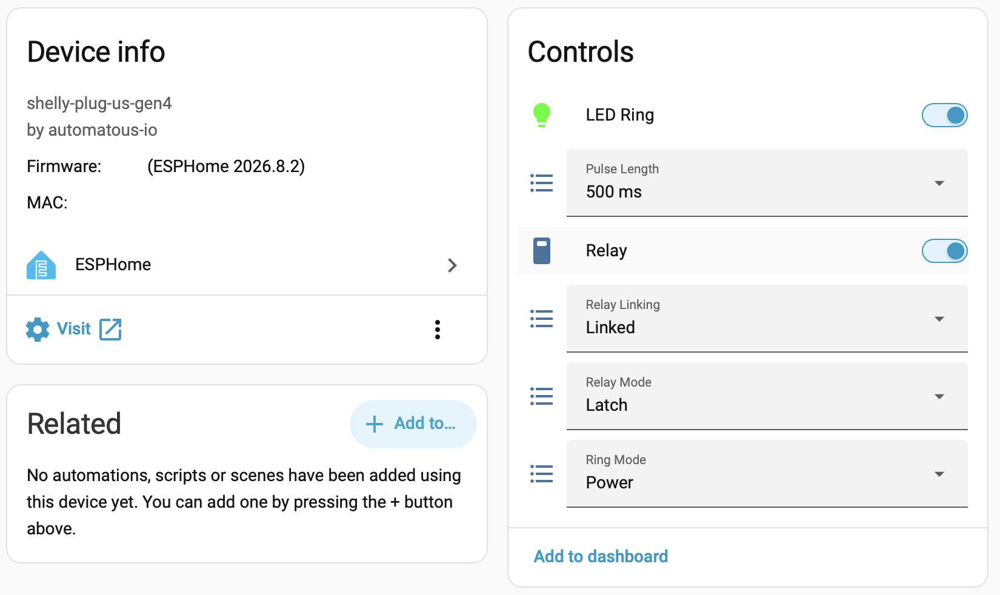
</p>
<p>
  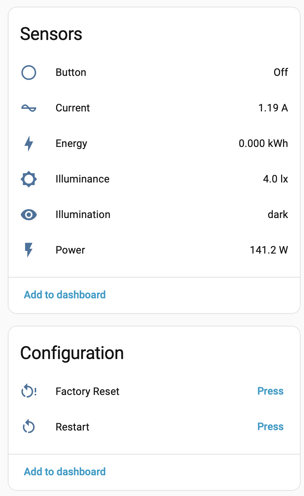
  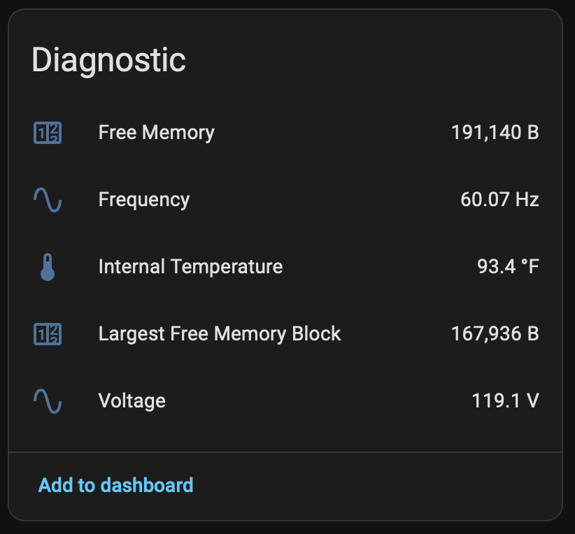
</p>

The EM Mini has the 1PM's metering entities and a `Button` sensor, with no relay or selects. `RTC Time` is diagnostic and shows what the battery-backed clock holds, or `not set` if it lost power. Shown here with a 141W resistive load through the CT clamp:

<p>
  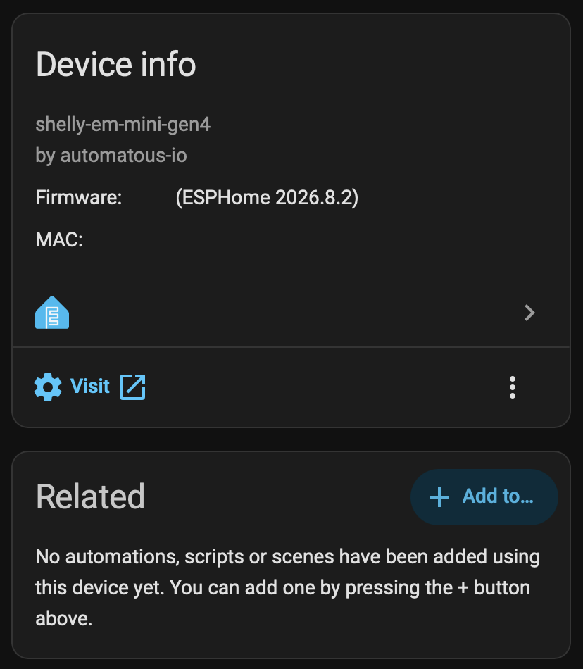
  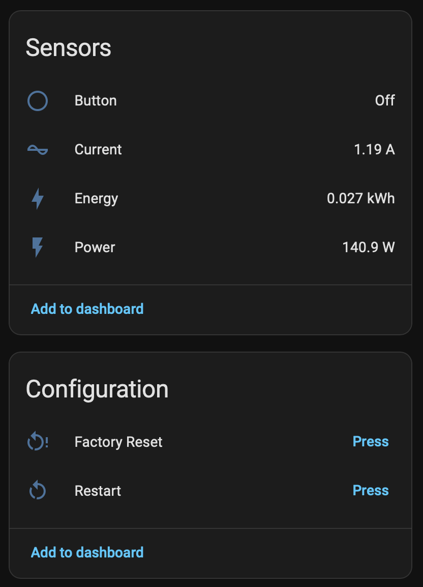
  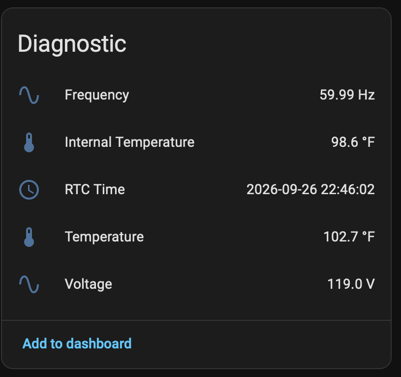
</p>

## Adoption and the stub

The device also broadcasts a `dashboard_import` URL, and ESPHome Builder offers to adopt it. Adoption creates a minimal stub in your config directory, roughly (a 1PM, 1 Mini, 1PM Mini, 2PM, Plug US, or EM Mini stub is identical with `shelly-1pm-gen4`, `shelly-1-mini-gen4`, `shelly-1pm-mini-gen4`, `shelly-2pm-gen4`, `shelly-plug-us-gen4`, or `shelly-em-mini-gen4` throughout):

```yaml
substitutions:
  name: shelly-1-gen4-52ab8c
  friendly_name: Shelly 1 Gen4

packages:
  automatous-io.shelly-1-gen4: github://automatous-io/shelly-gen4-esphome/configs/shelly-1-gen4.yaml@main

esphome:
  name: ${name}
  name_add_mac_suffix: false
  friendly_name: ${friendly_name}

api:
  encryption:
    key: ...
```

The stub is a reference, not a copy. Every build fetches this repository's config from `main` and merges your stub on top. The stub is also where customization lives; see [Customizing](CUSTOMIZING.md).

## The update channel

That package reference is the update channel. Improvements pushed here reach your device the next time you hit Install, with nothing to edit on your side (package fetches are cached for up to a day).

From 1.0.0 the stable ids, substitution names, and package URLs only change with a major version, and adopted devices can track `main` safely. To pin a known state instead, point the package ref at a tag or commit.

## Factory reset

Hold the device's button for 5 seconds (the `factory_reset_hold` substitution), or press the Factory Reset button in Home Assistant or on the device web page. This wipes all saved settings including Wi-Fi credentials and reboots into the first-boot hotspot.

## Related documentation

- [README](../README.md) — project overview and supported devices
- [Installing](INSTALL.md) — the web UI and UART paths
- [Customizing](CUSTOMIZING.md) — substitutions, stable ids, and package merging
- [Calibrating the Power Meter](CALIBRATION.md) — for the metering models
